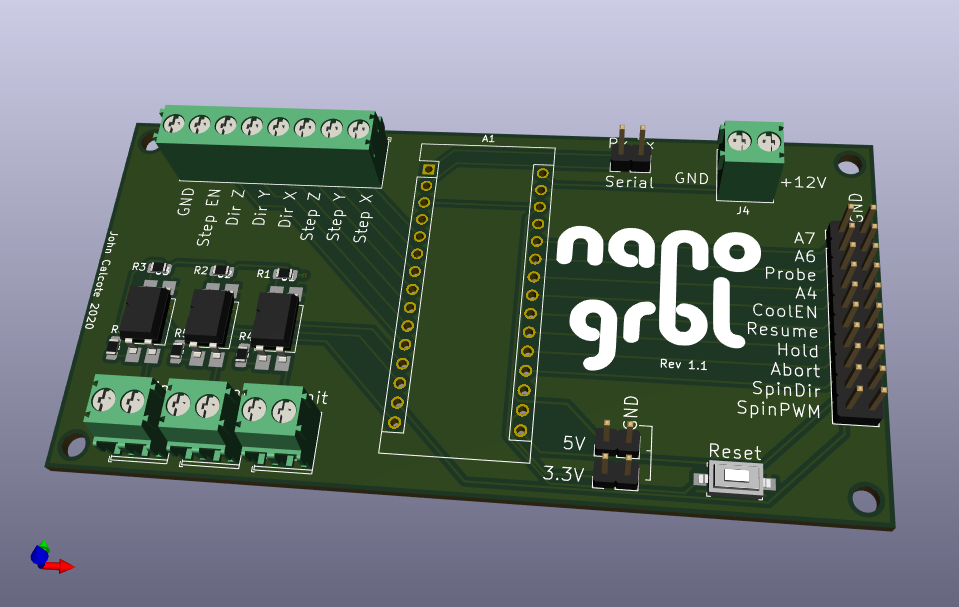

# nano-grbl
A KiCAD circuit board for embedding an Arduino Nano V3 and breaking out the I/O pins for GRBL.

This KiCAD project is a simple pcb allowing the embedding of an entire Arduino Nano along side minimal additional hardware for breaking out and labling I/O pins for the [GRBL](https://github.com/gnea/grbl) gcode interpreter software package.

## 3D Model

## Requirements

To use this KiCAD project, you should also clone my KiCAD parts library and add it to your clone of this project. See <https://github.com/jcalcote/KiCAD-footprints>.

## License

Creative Commons Zero 1.0 - Use at will and please enjoy.
